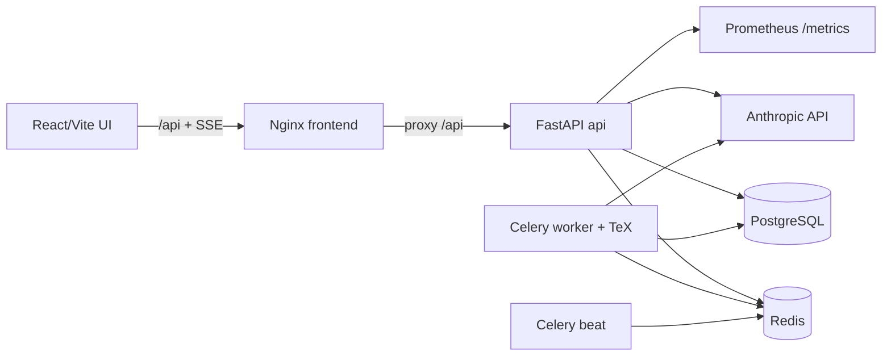
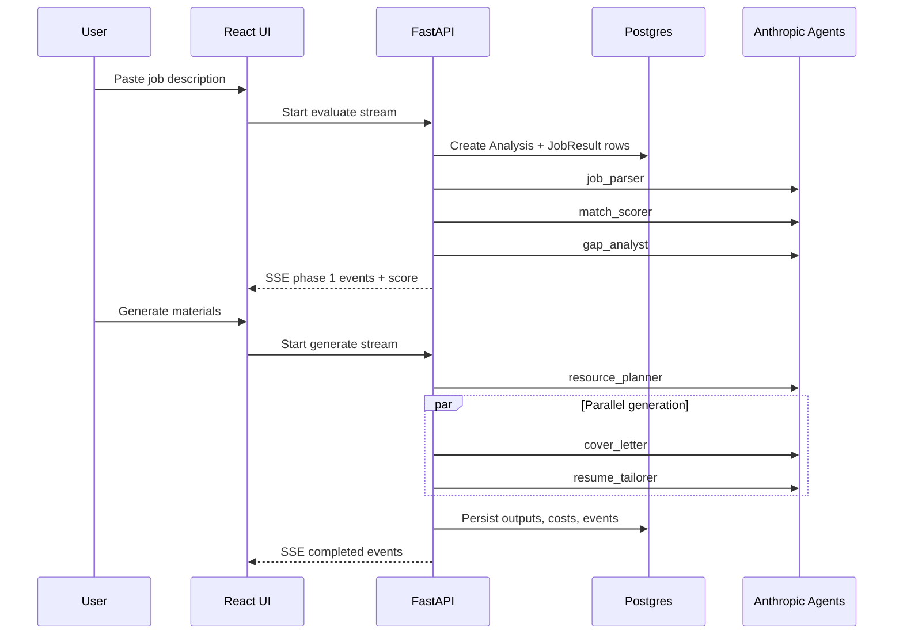

# JobFit Agent

JobFit Agent is a full-stack AI job-application assistant that evaluates job fit, generates application materials, discovers relevant jobs, and supports campaign-style application workflows.

It is built as a real application system rather than a thin ChatGPT prompt wrapper: the backend persists workflow state, validates LLM outputs with Pydantic schemas, streams progress to the UI, tracks LLM cost/latency, runs background Celery jobs, and ships with Docker Compose plus local Kubernetes manifests.

## What It Does

Users create a profile from CV/profile data, paste a job description, and receive:

- a structured job parse
- a match score
- gap analysis
- learning/resource recommendations
- a tailored cover letter
- tailored resume content downloadable as DOCX

The app also includes job discovery, saved jobs, contact discovery, cold-email drafting, admin invite/cost views, and regular-user campaign runs backed by Redis/Celery.

## Core Features

- **Profile setup**: upload CV, edit profile data, and build a compact profile for agent prompts.
- **Two-phase job analysis**: `job_parser -> match_scorer -> gap_analyst`, then generation with `resource_planner`, `cover_letter`, and `resume_tailorer`.
- **Live progress**: analysis/generation events stream to the browser over SSE.
- **History and results**: saved analyses, status updates, generated materials, DOCX resume download.
- **Job discovery**: HN/Remotive/Reed/Adzuna/WorkAtAStartup-style source clients and a scored discovery feed.
- **Saved jobs**: user-scoped job saving.
- **Contact workflow**: Hunter-backed contact discovery and cold-email drafting.
- **Campaign workflows**: Celery-backed regular-user campaign runs plus admin campaign endpoints.
- **Admin controls**: first registered user becomes admin; admin invite and cost pages are present.
- **Cost dashboard**: total spend, per-run/agent breakdown, Haiku/Sonnet cost comparison, and cache metrics.
- **Observability**: Prometheus endpoint at `/metrics`, structured logging, `PipelineEvent`, `LLMCall`.
- **Deployment**: Docker Compose local/demo stack, production-style Compose override, and local Kubernetes manifests.

## Architecture Overview



Main backend files:

- `backend/main.py`: FastAPI app, router registration, CORS, rate limiting, health check, Prometheus.
- `backend/routes/`: auth, profile, analyse, history, discovery, contacts, feedback, metrics, campaign, targets.
- `backend/services/orchestrator.py`: analysis/generation workflow and SSE events.
- `backend/agents/`: Anthropic-backed agent classes.
- `backend/models.py`: SQLAlchemy models for users, profiles, analyses, jobs, LLM calls, events, campaigns.
- `backend/celery_app.py` and `backend/tasks.py`: Redis/Celery queue, health tasks, campaign tasks.
- `alembic/`: startup migrations.

Frontend files:

- `frontend/src/api/client.ts`: API and SSE client.
- `frontend/src/pages/`: profile, analysis, results, discovery, saved jobs, costs, campaign, auth.
- `frontend/nginx.conf`: static frontend and `/api` proxy to the API service.

## AI Pipeline



Phase 1 is sequential because later agents depend on earlier structured outputs. Phase 2 can generate documents once the fit/gap context exists.

## Tech Stack

| Layer | Tech |
|---|---|
| Backend | Python 3.11, FastAPI, Pydantic v2, SQLAlchemy 2 async, Alembic |
| Frontend | React 19, Vite 8, TypeScript, Tailwind CSS, shadcn-style components |
| AI | Anthropic SDK, Claude Sonnet and Haiku model tiers |
| Database | PostgreSQL 16 locally in Docker/Kubernetes |
| Queue | Redis 7, Celery worker, Celery beat |
| Auth | Cookie JWT, bcrypt passwords, invite/admin boundaries |
| Observability | Prometheus FastAPI instrumentation, `LLMCall`, `PipelineEvent` |
| Deployment | Docker Compose, production-style Compose override, local Kubernetes manifests |
| CI | Python checks/tests, Docker target builds, Docker smoke validation |

## Local Development

```bash
cp .env.example .env
# edit .env and set at least ANTHROPIC_API_KEY and JWT_SECRET for real usage

pip install -r requirements.txt
cd frontend && npm install
cd ..

make run
```

Local URLs:

- Backend: http://localhost:8000
- Frontend Vite dev server: http://localhost:5173
- Health: http://localhost:8000/health
- Metrics: http://localhost:8000/metrics

Useful development commands:

```bash
make fmt
make lint
make test
make check
make eval-consistency
```

`make eval-consistency` runs an integration-marked consistency test and may require real Anthropic access.

## Docker Compose

The local/demo Compose stack runs the complete system:

- `api`: FastAPI backend image target, no TeX
- `frontend`: React build served by nginx
- `db`: PostgreSQL 16
- `redis`: Redis 7
- `worker`: Celery worker image target with TeX for campaign PDF resume generation
- `beat`: Celery beat image target, no TeX

```bash
cp .env.example .env
# edit .env and set ANTHROPIC_API_KEY and JWT_SECRET
docker compose build
docker compose up -d
docker compose ps
```

Docker URLs:

- Frontend: http://localhost:8080
- Backend API: http://localhost:8000
- Health: http://localhost:8000/health
- Metrics: http://localhost:8000/metrics

Run the Docker smoke test:

```bash
scripts/docker_smoke.sh
```

More details: `docs/docker.md`.

## Docker Notes

`docker-compose.prod.yml` is a production-style override for local validation, not a complete production deployment. It:

- removes host port publishing for Postgres, Redis, and API
- removes local `./data` and `./assets` bind mounts
- resets backend `env_file` usage
- sets `APP_ENV=production` and `COOKIE_SECURE=true`
- expects secrets and real origins from the deployment environment

Validate the merged config:

```bash
docker compose -f docker-compose.yml -f docker-compose.prod.yml config
```

When `APP_ENV=production`, the API refuses to boot with the default `JWT_SECRET`.

## Local Kubernetes

Plain Kubernetes manifests live under `k8s/`. This is a local kind/minikube deployment, not cloud Kubernetes and not Helm.

Workloads:

- `api` Deployment + Service, image `jobfit-api:local`
- `frontend` Deployment + Service, image `jobfit-frontend:local`
- `worker` Deployment, image `jobfit-worker:local`
- `beat` Deployment, image `jobfit-beat:local`
- `postgres` StatefulSet + Service + PVC
- `redis` Deployment + Service

Build and load images for kind:

```bash
docker build --target api -t jobfit-api:local .
docker build --target worker -t jobfit-worker:local .
docker build --target beat -t jobfit-beat:local .
docker build -t jobfit-frontend:local ./frontend

kind load docker-image jobfit-api:local --name jobfit
kind load docker-image jobfit-worker:local --name jobfit
kind load docker-image jobfit-beat:local --name jobfit
kind load docker-image jobfit-frontend:local --name jobfit
```

Apply manifests:

```bash
kubectl apply -f k8s/namespace.yaml
kubectl apply -f k8s/
kubectl -n jobfit get pods
kubectl -n jobfit get svc
kubectl -n jobfit get pvc
```

Access via port-forward:

```bash
kubectl -n jobfit port-forward svc/frontend 8080:80
kubectl -n jobfit port-forward svc/api 8000:8000
```

Run Kubernetes smoke validation:

```bash
scripts/k8s_smoke.sh
```

More details: `k8s/README.md`.

## Environment Variables

See `.env.example` for the current source of truth.

| Variable | Required | Notes |
|---|---|---|
| `ANTHROPIC_API_KEY` | For real LLM calls | Empty only works for mocked/test paths |
| `JWT_SECRET` | Required before sharing/exposing | Production mode rejects the default |
| `APP_ENV` | Optional | `development` by default; `production` enables stricter startup checks |
| `COOKIE_SECURE` | Optional | Set `true` behind HTTPS |
| `CORS_ORIGINS` | Optional | Comma-separated browser origins |
| `DATABASE_URL` | Optional locally | Compose/Kubernetes point this at Postgres service DNS |
| `DB_SSL` | Optional | Use `true` for managed Postgres; false locally |
| `REDIS_URL` | Optional | Compose/Kubernetes point this at Redis service DNS |
| `CELERY_BROKER_URL` / `CELERY_RESULT_BACKEND` | Optional | Defaults to `REDIS_URL` when empty |
| `CV_PATH` / `PROFILE_YAML_PATH` | Optional | Local profile input paths |
| `HUNTER_API_KEY` | Optional | Contact discovery |
| `GMAIL_CLIENT_ID` / `GMAIL_CLIENT_SECRET` / `GMAIL_REFRESH_TOKEN` | Optional | Gmail draft/send integration |
| `REED_API_KEY` | Optional | Reed discovery |
| `ADZUNA_APP_ID` / `ADZUNA_APP_KEY` | Optional | Adzuna discovery |
| `ENABLE_WORKATASTARTUP_SOURCE` | Optional | Enables WorkAtAStartup source |

Do not commit real `.env`, resumes, API keys, or OAuth tokens.

## Testing And Validation

Backend quality gate:

```bash
make check
```

Docker validation:

```bash
scripts/docker_smoke.sh
```

Kubernetes validation:

```bash
scripts/k8s_smoke.sh
```

CI workflows:

- `.github/workflows/ci.yml`: Ruff, mypy, schema drift, pytest.
- `.github/workflows/docker-image.yml`: Docker target builds, Compose config validation, Docker smoke.

## Observability And Cost Tracking

- `LLMCall` stores model, tokens, cost, latency, cache fields, analysis/run/user attribution.
- `PipelineEvent` stores spans, failures, retries, and tool events.
- `/metrics` exposes Prometheus metrics via `prometheus-fastapi-instrumentator`.
- Admin cost routes expose summaries and per-run/agent breakdowns.
- Discovery and campaign flows can use Haiku for lower-cost bulk scoring while Sonnet remains available for stronger generation/analysis paths.

## Security Notes

- Authentication uses HTTP-only cookie JWTs and bcrypt password hashing.
- First registered user becomes admin; invite/admin routes enforce role checks.
- Rate limiting uses SlowAPI.
- CORS origins are environment-configurable.
- Production mode refuses the published default `JWT_SECRET`.
- `COOKIE_SECURE=true` is available for HTTPS deployments.
- Docker production-style config avoids automatically reading a developer `.env`.
- Kubernetes manifests include `k8s/secret.example.yaml` with placeholders only.

