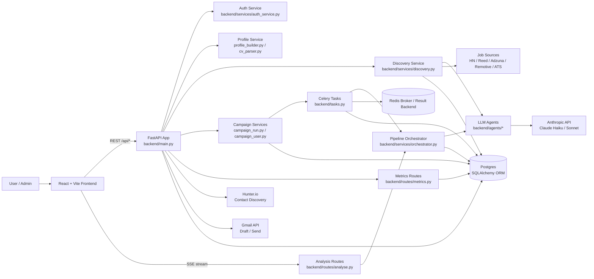

# System Overview

## Product Purpose

JobFit Agent is a full-stack AI job-application assistant. It helps a candidate turn a resume/profile and a job description into:

- a fit score,
- parsed job requirements,
- skill gaps,
- learning resources,
- a cover letter,
- a tailored resume,
- and, for admin workflows, discovered jobs and cold-email outreach.

The product is implemented as a React/Vite frontend, a FastAPI backend, async SQLAlchemy/Postgres persistence, Anthropic-backed agents, and Celery/Redis for campaign work.

Primary code entry points:

- Backend app: `backend/main.py`
- Frontend app: `frontend/src/App.tsx`
- Frontend API/SSE client: `frontend/src/api/client.ts`
- Core pipeline orchestration: `backend/services/orchestrator.py`
- Agent abstraction: `backend/agents/base.py`
- ORM models: `backend/models.py`
- Celery worker tasks: `backend/tasks.py`

## Core Workflow

The main user workflow is:

1. A user registers/logs in through `backend/routes/auth.py`.
2. The user uploads a resume or edits profile review data through `backend/routes/profile.py`.
3. The user pastes a job description in `frontend/src/pages/AnalyseJob.tsx`.
4. The frontend calls `POST /api/analyse` through `streamAnalysis()` in `frontend/src/api/client.ts`.
5. `run_evaluate_pipeline()` runs phase 1: `job_parser`, `match_scorer`, `gap_analyst`.
6. The user chooses whether to generate documents.
7. The frontend calls `POST /api/analyse/generate/{analysis_id}`.
8. `run_generate_pipeline()` runs phase 2: `resource_planner`, `cover_letter`, `resume_tailorer`.
9. The results page loads persisted output through `GET /api/analysis/{analysis_id}`.

The durable workflow record is `Analysis`; each agent step is stored as a `JobResult`.

## Why This Is Not a Simple ChatGPT Wrapper

A simple wrapper sends one prompt and displays one response. JobFit Agent is a workflow system around LLM calls:

- Agent outputs are typed with Pydantic schemas in `backend/schemas.py`.
- Each agent result is persisted independently in `JobResult`.
- The pipeline streams live progress over SSE.
- Partial failures are saved and retryable.
- LLM calls are tracked in `LLMCall` with tokens, model, latency, and cost.
- Pipeline spans/failures/retries are tracked in `PipelineEvent`.
- Discovery and campaign workflows reuse the analysis pipeline outside the request/response UI.
- Resume output is post-validated to reduce unsupported claims.

The hard engineering problem is not calling Claude. It is making slow, expensive, nondeterministic model work durable, observable, retryable, and useful to users.

## High-Level Architecture

The system is layered:

```text
React UI
  -> FastAPI routes
  -> Service orchestration
  -> Agents / external API adapters
  -> Anthropic, job boards, Hunter.io, Gmail
  -> SQLAlchemy/Postgres persistence
```

Important boundaries:

- Routes own HTTP/auth/response shape.
- Services own workflows and business rules.
- Agents own prompt loading, Anthropic calls, parsing, and schema validation.
- Models own durable workflow state.
- Celery owns long-running regular-tier campaign execution.

Discovery is currently implemented with in-process `asyncio.create_task()` in `backend/services/discovery.py`, while regular-tier campaign execution uses Celery in `backend/tasks.py`. That difference is a production-readiness gap documented in `05-production-readiness.md`.

## Mermaid System Diagram


