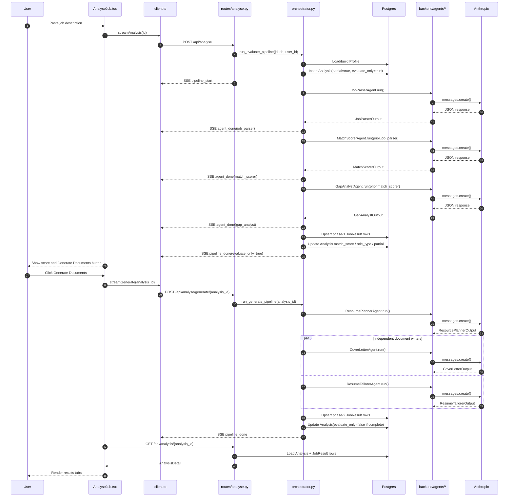

# Core Pipeline

## Analysis / JobResult Workflow Model

The central workflow aggregate is `Analysis` in `backend/models.py`.

`Analysis` represents one job-description evaluation for a profile. It stores:

- `jd_text`: the job description,
- `profile_id`: the candidate profile used,
- `user_id`: the owner,
- `job_id`: optional discovered job linkage,
- `partial`: whether any required step is missing or failed,
- `evaluate_only`: whether only phase 1 has completed,
- `jd_hash`: cache key,
- denormalized fields like `role_type`, `company`, and `match_score`,
- `retry_running_at`: concurrency guard for retry.

`JobResult` stores the output of one agent step:

- `analysis_id`,
- `agent_name`,
- `output_json`,
- `error`,
- `error_code`,
- `retry_count`.

The service helper `upsert_job_result()` in `backend/services/job_result.py` enforces a one-row-per-`(analysis, agent)` invariant in application code by deleting prior rows and inserting a fresh row.

Production improvement: this invariant should also be enforced with a database unique constraint.

## Phase 1 Evaluate Pipeline

Phase 1 is implemented by `run_evaluate_pipeline()` in `backend/services/orchestrator.py`.

Agents:

1. `JobParserAgent`
2. `MatchScorerAgent`
3. `GapAnalystAgent`

Why these run sequentially:

- `match_scorer` needs parsed requirements from `job_parser`.
- `gap_analyst` needs match/missing-skill output from `match_scorer`.

Phase 1 uses a compact profile for early steps:

- `build_compact_profile()` includes YAML plus a short CV summary.
- `gap_analyst` receives the full merged profile.

The phase creates the `Analysis` row before LLM calls so `LLMCall` records can be linked to `analysis_id`.

## Phase 2 Generate Pipeline

Phase 2 is implemented by `run_generate_pipeline()` and `run_steps()`.

Agents:

1. `ResourcePlannerAgent`
2. `CoverLetterAgent`
3. `ResumeTailorerAgent`

`resource_planner` runs before the document writers. `cover_letter` and `resume_tailorer` run concurrently because they are independent once phase-1 context exists.

Important implementation detail: concurrent phase-2 agents open their own `SessionLocal()` sessions inside `run_steps()`. Sharing one async SQLAlchemy session across concurrent coroutines can corrupt unit-of-work state.

## SSE Event Flow

The route `POST /api/analyse` in `backend/routes/analyse.py` wraps orchestrator events as SSE:

```text
pipeline_start
agent_start
agent_done OR pipeline_error
...
pipeline_done
```

The frontend parser is `_streamSSE()` in `frontend/src/api/client.ts`.

`pipeline_done` is terminal. The frontend aborts the stream after receiving it.

## Retry Flow

Retry starts at:

- Frontend: `retryAnalysis()` in `frontend/src/api/client.ts`
- Route: `retry_analysis()` in `backend/routes/analyse.py`
- Service: `run_retry_pipeline()` in `backend/services/orchestrator.py`

Retry behavior:

- Normal users rerun only failed/missing steps.
- Admins may use `scope="all"` to rerun successful steps.
- `Analysis.retry_running_at` prevents duplicate concurrent retry execution.
- Results are written in place through `upsert_job_result()`.

Current trade-off: if an upstream step is rerun, downstream successful outputs are not automatically invalidated. That is acceptable for targeted retries but should be revisited if upstream-rerun behavior becomes common.

## Mermaid Sequence Diagram


