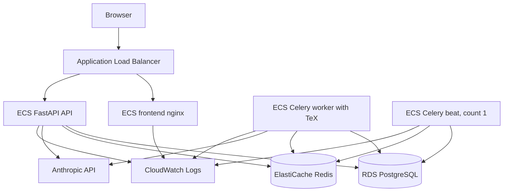

# AWS ECS Fargate Deployment

This folder documents a practical staging/demo AWS deployment for JobFit Agent. It intentionally does not introduce Terraform, CDK, Helm, EKS, or Bedrock. The existing Anthropic integration remains unchanged.

## Target Architecture

JobFit maps cleanly from local Docker Compose to AWS managed services:

| Local service | AWS service | Notes |
| --- | --- | --- |
| `api` | ECS Fargate service | FastAPI container built from Dockerfile target `api`; no TeX packages. |
| `frontend` | ECS Fargate service | nginx container built from `frontend/Dockerfile`; serves the Vite build only. ALB routes `/api/*` directly to the API service. |
| `worker` | ECS Fargate service | Celery worker built from Dockerfile target `worker`; includes TeX for resume generation. |
| `beat` | ECS Fargate service | Celery beat built from Dockerfile target `beat`; desired count must be exactly `1`. |
| `db` | RDS PostgreSQL | Replaces container Postgres. Enable backups for staging. |
| `redis` | ElastiCache Redis | Replaces container Redis. Keep private in the VPC. |
| local `.env` | Secrets Manager or SSM Parameter Store | No secrets should be committed or stored in task definitions. |
| Compose logs | CloudWatch Logs | All ECS containers write stdout/stderr to CloudWatch. |

Optional later: move persistent uploaded resumes/assets to S3. The current staging task definitions use baked fallback assets from the Docker image and do not mount local files.



## Deployment Flow

1. Build Docker images from the existing Dockerfiles.
2. Push images to ECR:
   - `jobfit-api`
   - `jobfit-worker`
   - `jobfit-beat`
   - `jobfit-frontend`
3. Render ECS task definitions with the pushed image URIs.
4. Run Alembic migrations as an ECS one-off task using the rendered API task definition.
5. Deploy ECS services:
   - `jobfit-api-service`
   - `jobfit-worker-service`
   - `jobfit-beat-service`
   - `jobfit-frontend-service`
6. Verify each service is bound to the expected task family/log stream.
7. Smoke test the public health URL.

The provided GitHub Actions workflow uses OIDC and an IAM role. It does not use long-lived AWS access keys.

## Deploy Triggers and Service Deployment Configuration

> **Important:** the settings in this section live on the **ECS services** (and the
> deploy workflow trigger), **not** in `infra/aws/task-definitions/*.json`. Registering
> a new task definition or deploying does **not** reset them — but recreating a service
> from scratch does. Re-apply them with the CLI commands below if a service is rebuilt.

### Deploy triggers (`.github/workflows/deploy-aws.yml`)

- Deploys run **only on `v*` git tags** or manual `workflow_dispatch` — not on every push
  to `main`. Release with `git tag vX.Y.Z && git push origin vX.Y.Z`.
- A `concurrency: { group: deploy-aws-ecs, cancel-in-progress: false }` guard **serializes**
  deploys. Rationale: ECS runs one deployment per service, so overlapping runs supersede each
  other and the older run fails `wait-for-service-stability` with "deployment not found".

### Deployment circuit breaker (all four services)

All services run the **ECS rolling** controller with the deployment circuit breaker
**enabled and set to roll back**, so a deploy whose new tasks never stabilize auto-reverts
to the last-good task definition instead of getting stuck:

```bash
for s in api worker frontend; do
  aws ecs update-service --cluster jobfit-cluster --service "jobfit-$s-service" \
    --deployment-configuration "deploymentCircuitBreaker={enable=true,rollback=true},minimumHealthyPercent=100,maximumPercent=200"
done
```

### Beat must be a singleton (`jobfit-beat-service`)

`beat` is the Celery scheduler and **must never run two tasks at once** (duplicate tasks would
be enqueued). With the default `minimumHealthyPercent=100 / maximumPercent=200`, a rolling
deploy briefly runs two beat tasks. So beat uses **stop-old-then-start-new** (`min 0 / max 100`).
That requires **Availability Zone Rebalancing disabled** (AZ rebalancing forbids `maximumPercent <= 100`);
this is fine for a single-task service. Tradeoff: a brief no-scheduler gap during a deploy,
which is acceptable for a cron-style scheduler.

```bash
aws ecs update-service --cluster jobfit-cluster --service jobfit-beat-service \
  --availability-zone-rebalancing DISABLED \
  --deployment-configuration "deploymentCircuitBreaker={enable=true,rollback=true},minimumHealthyPercent=0,maximumPercent=100"
```

| Service | min% | max% | AZ rebalancing | Circuit breaker + rollback |
| --- | --- | --- | --- | --- |
| `jobfit-api-service` | 100 | 200 | enabled | yes |
| `jobfit-worker-service` | 100 | 200 | enabled | yes |
| `jobfit-frontend-service` | 100 | 200 | enabled | yes |
| `jobfit-beat-service` | 0 | 100 | **disabled** | yes |

## Required AWS Resources

Create these before running the deployment workflow:

- ECR repositories:
  - `jobfit-api`
  - `jobfit-worker`
  - `jobfit-beat`
  - `jobfit-frontend`
- ECS cluster: `jobfit-cluster`
- ECS services:
  - `jobfit-api-service`
  - `jobfit-worker-service`
  - `jobfit-beat-service`
  - `jobfit-frontend-service`
- ECS task execution role with ECR pull and CloudWatch Logs permissions.
- ECS task role with only the runtime permissions the app needs.
- CloudWatch log groups:
  - `/ecs/jobfit-api`
  - `/ecs/jobfit-frontend`
  - `/ecs/jobfit-worker`
  - `/ecs/jobfit-beat`
- RDS PostgreSQL instance or cluster.
- ElastiCache Redis replication group or single-node cache for staging.
- Application Load Balancer.
- Target groups for frontend and API.
- Security groups:
  - ALB accepts public HTTPS.
  - ECS tasks accept traffic only from ALB where applicable.
  - RDS accepts traffic only from ECS tasks.
  - Redis accepts traffic only from ECS tasks.
- ACM certificate for HTTPS if exposing the staging app publicly.
- Secrets Manager or SSM Parameter Store values for secrets.

## GitHub Secrets and Variables

Required GitHub secret:

- `AWS_GITHUB_ACTIONS_ROLE_ARN`: IAM role ARN trusted by GitHub OIDC.

Optional GitHub variable or secret:

- `AWS_APP_HEALTH_URL`: full public health URL to smoke test after deployment, for example `https://jobfit.example.com/api/health`.

The workflow defaults to:

- Region: `eu-west-2`
- Cluster: `jobfit-cluster`
- Services: `jobfit-api-service`, `jobfit-worker-service`, `jobfit-beat-service`, `jobfit-frontend-service`

## Application Environment Variables

Non-secret values can live in task definition `environment` entries:

- `APP_ENV=production`
- `API_PREFIX=/api`
- `DB_SSL=false` or `true`, depending on the RDS/driver TLS requirement
- `CORS_ORIGINS=https://your-staging-domain.example`
- `COOKIE_SECURE=true`
- `LOG_LEVEL=INFO`
- `ANTHROPIC_MAX_RETRIES=3`
- `EMBEDDING_PROVIDER=openai`
- `EMBEDDING_MODEL=text-embedding-3-small`
- `EMBEDDING_DIMENSIONS=1536`
- `PGVECTOR_ENABLED=true`
- `CV_PATH=/app/data/cv.pdf`
- `PROFILE_YAML_PATH=/app/data/candidate_profile.yaml`
- `ENABLE_WORKATASTARTUP_SOURCE=false`

Sensitive values should live in Secrets Manager or SSM Parameter Store and be referenced from ECS task definition `secrets`:

- `DATABASE_URL`
- `REDIS_URL`
- `CELERY_BROKER_URL`
- `CELERY_RESULT_BACKEND`
- `JWT_SECRET`
- `ANTHROPIC_API_KEY`
- `OPENAI_API_KEY`
- `HUNTER_API_KEY`
- `GMAIL_CLIENT_ID`
- `GMAIL_CLIENT_SECRET`
- `GMAIL_REFRESH_TOKEN`
- `REED_API_KEY`
- `ADZUNA_APP_ID`
- `ADZUNA_APP_KEY`

`CELERY_BROKER_URL` and `CELERY_RESULT_BACKEND` may be the same Redis URL. The backend falls back to `REDIS_URL` when those variables are empty, but ECS uses explicit secret references for clarity.

## Routing Model

The frontend client uses relative `/api` paths in `frontend/src/api/client.ts`. That is deployment-friendly.

Use ALB path routing for ECS:

- `/api/*` -> API target group on port `8000`
- `/*` -> frontend target group on port `80`

The production frontend image uses `frontend/nginx.prod.conf`, which serves static files and does not reference the Docker Compose hostname `api`. Local Docker Compose explicitly builds the frontend with `NGINX_CONF=nginx.conf` so the Compose-only nginx `/api/` proxy still works.

## Migration Strategy

AWS task definitions set `RUN_MIGRATIONS_ON_STARTUP=false` for the API service. The main deploy workflow runs Alembic as a one-off ECS task before updating the API service, then verifies that each ECS service is attached to the expected task family and CloudWatch log stream.

The staging migration task uses `assignPublicIp=ENABLED`, matching the staging ECS services. If you move ECS tasks to private subnets without public IPs, add NAT or VPC endpoints for SSM Parameter Store, ECR, and CloudWatch Logs before switching migrations to `assignPublicIp=DISABLED`.

For manual recovery or out-of-band schema changes, use the provided GitHub workflow:

```bash
gh workflow run aws-migrate.yml
```

Equivalent AWS CLI command:

```bash
aws ecs run-task \
  --cluster jobfit-cluster \
  --launch-type FARGATE \
  --task-definition jobfit-api \
  --network-configuration 'awsvpcConfiguration={subnets=[subnet-REPLACE_ME],securityGroups=[sg-REPLACE_ME],assignPublicIp=ENABLED}' \
  --overrides '{"containerOverrides":[{"name":"api","command":["alembic","upgrade","head"]}]}'
```

Replace subnet and security group IDs with ECS subnet/security group values that can reach RDS and AWS service endpoints.

## Task Definition Templates

Templates live in `infra/aws/task-definitions/`.

They contain placeholder ARNs and image URIs such as:

- `<AWS_ACCOUNT_ID>.dkr.ecr.eu-west-2.amazonaws.com/jobfit-api:latest`
- `arn:aws:ssm:eu-west-2:<AWS_ACCOUNT_ID>:parameter/jobfit/staging/database-url`

The deploy workflow renders image URIs automatically. Replace role ARNs and secret parameter ARNs before registering task definitions for a real AWS account.

## Staging Caveats

This is a staging/demo deployment baseline, not full production hardening. Before using it for real users, add:

- S3-backed upload persistence for resumes and generated assets.
- CloudWatch alarms for API 5xx, task restarts, RDS/Redis health, and Anthropic spend.
- WAF/rate-limit policy at the ALB or CloudFront layer.
- Backups and restore drills for RDS.
- Stronger runtime metrics and tracing.
- A reviewed IAM least-privilege policy.
